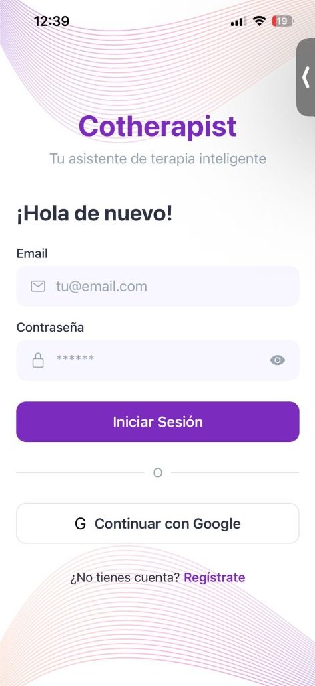
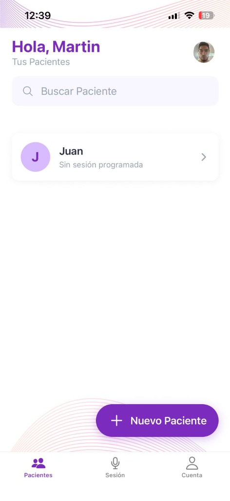
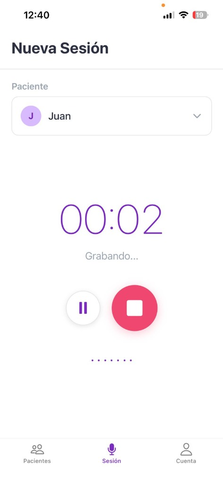

# Cotherapist - Tu Asistente de Terapia Inteligente

**Cotherapist** es una aplicación móvil diseñada para ayudar a terapeutas a organizar, registrar y gestionar las sesiones con sus pacientes de manera eficiente y segura.

## 🚀 Características Principales

*   **Gestión de Pacientes**: Agrega y administra tu lista de pacientes fácilmente.
*   **Grabación de Sesiones**: Graba audio de las sesiones directamente en la app.
*   **Sincronización Segura**: Los datos se almacenan localmente (SQLite) para acceso rápido y offline, y se respaldan en la nube (Firebase).
*   **Diseño Intuitivo**: Interfaz limpia y moderna pensada para profesionales.
*   **Autenticación**: Registro e inicio de sesión seguro (Email/Password).

## 🛠 Tecnologías Utilizadas

*   **Frontend**: React Native con Expo.
*   **Base de Datos Local**: SQLite (usando `expo-sqlite`).
*   **Backend & Cloud**: Firebase (Auth, Storage, Firestore).
*   **Navegación**: React Navigation.
*   **Diseño**: Estilos personalizados con componentes modulares (`WaveBackground`).

## 📦 Instalación y Uso

1.  **Clonar el repositorio**:
    ```bash
    git clone https://github.com/mrdesautu/cotherapistapp.git
    cd cotherapistapp
    ```

2.  **Instalar dependencias**:
    ```bash
    npm install
    ```

3.  **Configuración de Entorno**:
    *   Asegúrate de tener los archivos de configuración de Firebase (`google-services.json` / `GoogleService-Info.plist`) en la raíz del proyecto si planeas compilar nativamente, o configurar las credenciales en `firebase.ts`.

4.  **Ejecutar la aplicación**:
    ```bash
    npx expo start -c
    ```

## 📱 Galería de Pantallas

A continuación se muestra el flujo principal de la aplicación:

### Autenticación y Perfil
| Login | Mi Cuenta |
|:---:|:---:|
|  |  |

### Gestión de Pacientes y Sesiones
| Home (Pacientes) | Grabación de Sesión |
|:---:|:---:|
|  |  |
