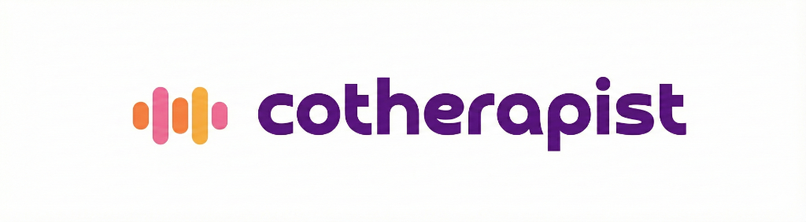

# Cotherapist



> *Tu asistente de terapia inteligente, siempre disponible.*

Cotherapist es una aplicación móvil inteligente diseñada para asistir a terapeutas en la gestión de sus pacientes y sesiones. La aplicación permite grabar sesiones, gestionar perfiles de pacientes y mantener un registro seguro y sincronizado de la información clínica, funcionando de manera robusta tanto con conexión a internet como en modo offline.

## Características Principales (Features)

*   **Gestión de Pacientes**: Creación, edición y listado de pacientes con información detallada.
*   **Grabación de Sesiones**: Herramienta integrada para grabar audio de las sesiones terapéuticas directamente en el dispositivo.
*   **Arquitectura Offline-First**: Los datos se guardan primero localmente (SQLite), permitiendo el uso completo de la app sin internet.
*   **Sincronización Inteligente**: Sistema de cola (`syncQueue`) que sincroniza automáticamente los datos y archivos con Firebase cuando se recupera la conexión.
*   **Autenticación Segura**: Inicio de sesión con correo/contraseña y Google Sign-In, con persistencia de sesión segura.
*   **Reproducción de Audio**: Acceso y reproducción de las sesiones grabadas.
*   **Perfil de Terapeuta**: Gestión de la información profesional del usuario.

## Tecnologías y Librerías Utilizadas

El proyecto está construido con **React Native** usando **Expo**, seleccionando cada librería cuidadosamente para garantizar rendimiento y mantenibilidad:

### Core & UI
*   **`expo`**: Framework base que facilita el desarrollo, despliegue y acceso a APIs nativas de forma unificada.
*   **`react-native`**: Biblioteca principal para construir la interfaz móvil nativa usando React.
*   **`@react-navigation/native` & stacks**: Manejo de navegación entre pantallas y flujos de usuario (Stacks y Bottom Tabs).
*   **`react-native-safe-area-context`**: Gestión de áreas seguras en dispositivos con notches o islas dinámicas.

### Gestión de Datos & Backend
*   **`firebase`**: Plataforma integral para el backend (Firebase Auth para usuarios, Realtime Database para datos JSON, Storage para archivos de audio).
*   **`expo-sqlite`**: Motor de base de datos SQL local. Fundamental para nuestra arquitectura *Offline-First*, permitiendo persistencia de datos relacionales en el dispositivo.
*   **`@react-native-async-storage/async-storage`**: Almacenamiento clave-valor simple, utilizado para persistencia de estados de autenticación y configuraciones ligeras.
*   **`@react-native-community/netinfo`**: Detección del estado de la red para activar/pausar la sincronización en segundo plano.

### Multimedia & Utilidades
*   **`expo-av`**: Manejo avanzado de audio para la grabación y reproducción de sesiones.
*   **`expo-auth-session`**: Gestión segura de flujos de autenticación OAuth (Google).
*   **`expo-crypto`**: Generación de UUIDs y operaciones criptográficas.
*   **`yup`**: Validación de esquemas para formularios robustos y seguros.
*   **`react-native-chart-kit`**: Visualización de datos y progreso del paciente.

## Instalación y Puesta a Punto

Sigue estos pasos para ejecutar el proyecto en tu entorno local:

### 1. Prerrequisitos
Asegúrate de tener instalado:
*   [Node.js](https://nodejs.org/) (versión LTS recomendada).
*   [Git](https://git-scm.com/).
*   Dispositivo físico (con Expo Go app) o simulador (iOS/Android).

### 2. Clonar el repositorio
```bash
git clone https://github.com/mrdesautu/cotherapistapp.git
cd cotherapistapp
```

### 3. Instalar dependencias
```bash
npm install
```

### 4. Configuración de Variables de Entorno
El proyecto utiliza un archivo `.env` para las credenciales de Firebase. Crea un archivo `.env` en la raíz del proyecto y agrega tus claves (puedes basarte en el ejemplo proporcionado o solicitar las claves al administrador del proyecto):

```env
EXPO_PUBLIC_FIREBASE_API_KEY=tu_api_key
EXPO_PUBLIC_FIREBASE_AUTH_DOMAIN=tu_proyecto.firebaseapp.com
EXPO_PUBLIC_FIREBASE_DATABASE_URL=https://tu_proyecto.firebaseio.com
EXPO_PUBLIC_FIREBASE_PROJECT_ID=tu_project_id
EXPO_PUBLIC_FIREBASE_STORAGE_BUCKET=tu_bucket.firebasestorage.app
EXPO_PUBLIC_FIREBASE_MESSAGING_SENDER_ID=tu_sender_id
EXPO_PUBLIC_FIREBASE_APP_ID=tu_app_id
```

### 5. Configuración de Google Sign-In (Opcional para desarrollo local)
Para que Google Sign-In funcione en desarrollo, asegúrate de tener configurado el esquema de URL en `app.json` y los identificadores de cliente (Client IDs) correspondientes en la consola de Google Cloud.

### 6. Ejecutar la aplicación
Inicia el servidor de desarrollo de Expo:

```bash
npx expo start -c
```
*El flag `-c` limpia la caché, recomendado al cambiar variables de entorno.*

*   Presiona `i` para abrir en simulador iOS.
*   Presiona `a` para abrir en emulador Android.
*   Escanea el código QR con la app **Expo Go** en tu dispositivo físico.

---
**Nota**: Este proyecto utiliza Prebuild/Development Client para ciertas funcionalidades nativas. Si encuentras errores con librerías nativas, intenta generar un cliente de desarrollo con `npx expo run:ios` o `npx expo run:android`.

## 📸 Galería de Pantallas

### Autenticación y Perfil
| Login | Mi Cuenta |
|:---:|:---:|
|  |  |

### Gestión de Pacientes y Sesiones
| Home (Pacientes) | Grabación de Sesión |
|:---:|:---:|
|  |  |
